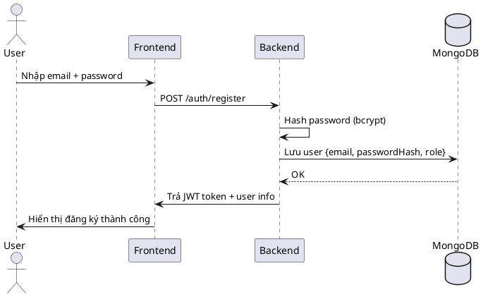
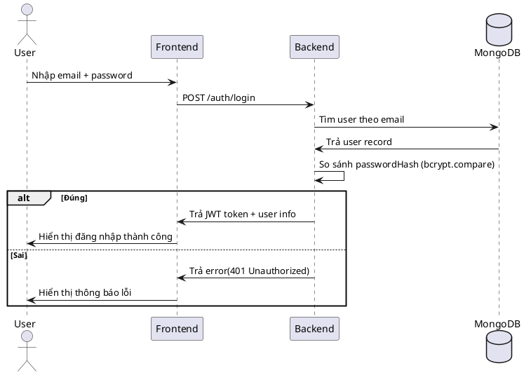

**Luồng đăng ký(register):**

```plantuml
@startuml
actor User
participant Frontend
participant Backend
database MongoDB

User -> Frontend: Nhập email + password
Frontend -> Backend: POST /auth/register
Backend -> Backend: Hash password (bcrypt)
Backend -> MongoDB: Lưu user {email, passwordHash, role}
MongoDB --> Backend: OK
Backend -> Frontend: Trả JWT token + user info
Frontend -> User: Hiển thị đăng ký thành công
@enduml

```

**Luông đăng nhập(login)**

```plantuml
@startuml
actor User
participant Frontend
participant Backend
database MongoDB

User -> Frontend: Nhập email + password
Frontend -> Backend: POST /auth/login
Backend -> MongoDB: Tìm user theo email
MongoDB -> Backend: Trả user record
Backend -> Backend: So sánh passwordHash (bcrypt.compare)
alt Đúng
	Backend -> Frontend: Trả JWT token + user info
	Frontend -> User: Hiển thị đăng nhập thành công
else Sai
	Backend -> Frontend: Trả error(401 Unauthorized)
	Frontend -> User: Hiển thị thông báo lỗi
end
@enduml

```

**JWT token:** expiry ngắn (15-30 phút), refresh token dài hơn
